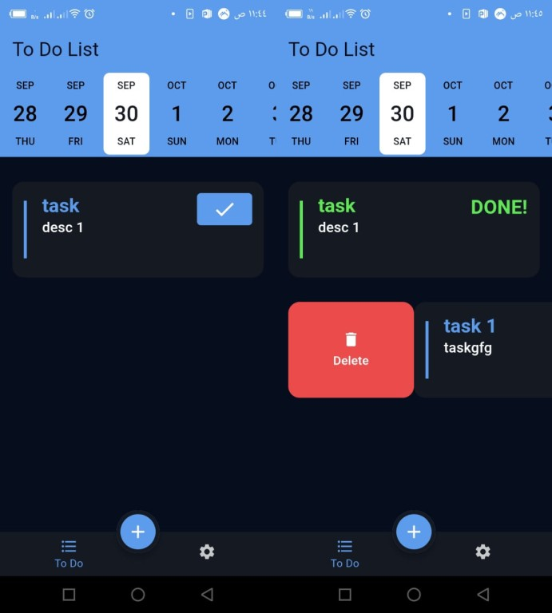
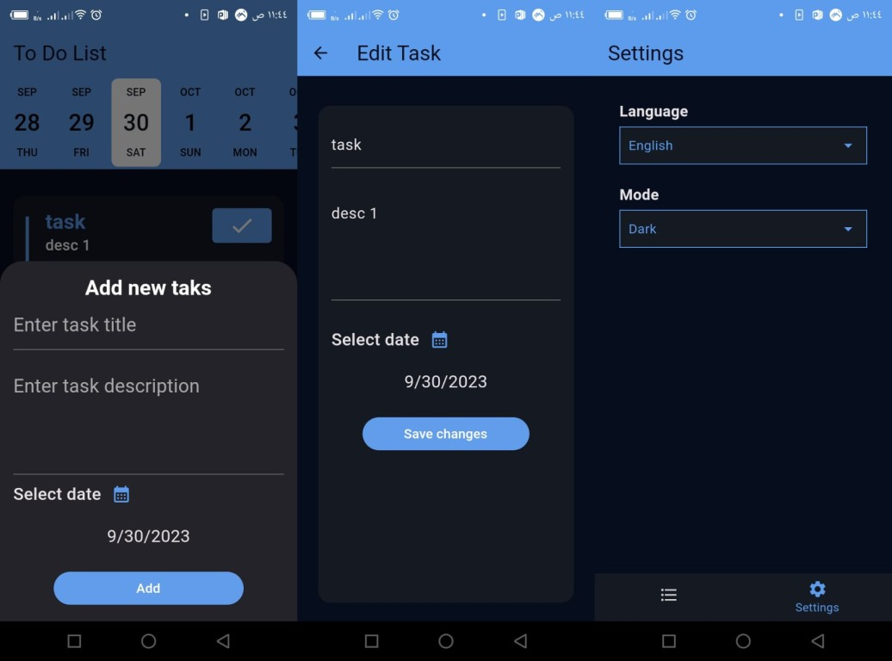

# TODO Application

### What did I learn?
1. New Widgets
2. Using multiple Providers which depened my understanding of State Management
3. How to work with DateTime.
4. How to make CRUD apps using Local Storage(Firestore)
5. An introduction to Firebase
6. How to organize the code and seprate the UI from logic

### Screenshots

-------------------
